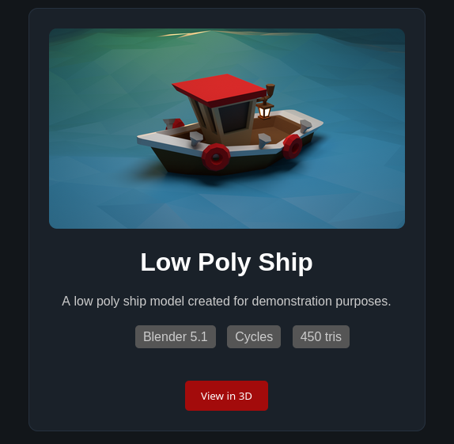

# 🚢 Low Poly Ship - Asset Showcase Card

Une carte d'interface web "Showcase" moderne et minimaliste conçue pour mettre en valeur un asset 3D low-poly. Ce projet applique les principes de l'intégration sémantique et du design en mode sombre (*Dark Mode*).

# # Low Poly Ship Card 🚤

HTML/CSS showcase for Blender asset. Built in 10min Day 7 #100DaysOfCode.

**Stack:** HTML5 Semantic + CSS3 + Blender 5.1
**Live:** cedricboucard.github.io/low-poly-ship-card/

**Day 7 Triple Ship:** HTML/CSS + Blender + Showcase

# Low Poly Boat 🚤
Blender 5.1 | Cycle| Following tutorial by [Polygon Runway
]

# Screenshot 

## Live Demo 

https://cedricboucard.github.io/lowpoly-ship/